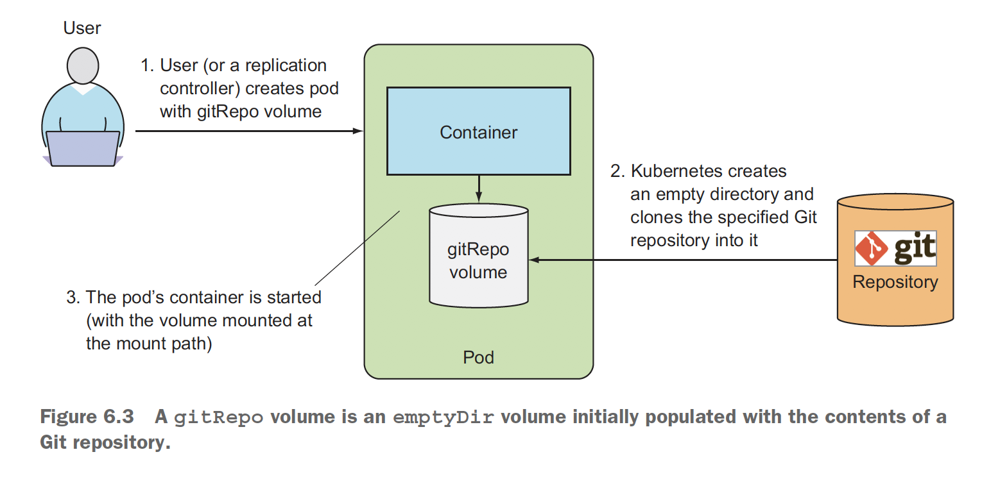
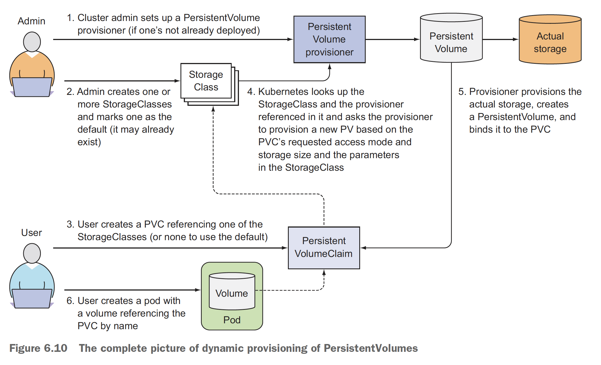

# 쿠버네티스 인 액션 6장 볼륨: 컨테이너에 디스크 스토리지 연결


- 목차
개요
다중 컨테이너 파드 생성
컨테이너 간 디스크 스토리지를 공유하기 위한 볼륨 생성
파드 내부에 깃 리포지터리 사용
파드에 GCE 퍼시스턴트 디스크와 같은 퍼시스턴트 스토리지 연결
사전 프로비저닝된 퍼시스턴트 스토리지
퍼시스턴트 스토리지의 동적 프로비저닝
참고
질문


## 0 개요
> 컨테이너가 어떻게 외부 디스크 스토리지에 접근하고, 컨테이너간 스토리지를 공유하는 지를 학습합니다

## 1 다중 컨테이너 파드 생성
## 2 컨테이너 간 디스크 스토리지를 공유하기 위한 볼륨 생성
## 3 파드 내부에 깃 리포지터리 사용
## 4 파드에 GCE 퍼시스턴트 디스크와 같은 퍼시스턴트 스토리지 연결
## 5 사전 프로비저닝된 퍼시스턴트 스토리지
## 6 퍼시스턴트 스토리지의 동적 프로비저닝
## 8 참고
* https://kubernetes.io/docs/concepts/storage/persistent-volumes/
* https://zgundam.tistory.com/179
## 9 질문
* 공유 볼륨 컨테이너가 죽는 경우는 어떻게 복구할 수 있는가? 결국 NAS 혹은 블록 스토리지가 정답일까요?
* 도커를 통해 제공되는 bind volume 혹은 named volume 은 기본 용량이 어떻게 될까? 무제한일까? 기본 값은 있는가?
* 도커를 통해 제공되는 cpu 는 어떻게 제어되는가? 기본 값은 어느 정도 cpu 를 사용하는가?
* 도커를 통해 제공되는 memory 는 기본 값은 무제한인가? 호스트의 어느 정도의 memory 를 사용하는가?


## 6.1 볼륨 소개
### 6.1.1 예제 볼륨 설명


### 6.1.2 사용 가능한 볼륨 유형 소개
* emptyDir : 도커의 named volume 과 유사하게 일시적인 데이터를 저장하는 데에 사용
* hostPath : 도커의 bind volume 과 유사하게 워커 노드의 파일시스템을 마운트하여 사용
* gitRepo : 깃 리포지터리의 콘텐츠를 체크아웃으로 초기화한 볼륨
* nfs: NFS 공유를 마운트합니다
* gcePersistentDisk, awsElasticBlockStore, azureDisk : 클라우드 제공자의 블록스토리지
* cinder, cephfs, ... scaieIO
* configMap, secret, downwardAPI : 쿠버네티스 리소스나, 클러스터 정보를 파드에 노출할 때에 사용하는 특별한 볼륨
* persistentVolumeClaim: 사전 혹은 동적으로 프로비저닝된 퍼시스턴트 스토리지를 사용하는 방법


## 6.2 볼륨을 사용한 컨테이너 간 데이터 공유
### 6.2.1 emptyDir
> 파드가 삭제되면 볼륨 또한 삭제되며 파드 내의 컨테이너 간의 임시 파일을 공유할 때에 사용

### 6.2.2 깃 리포지터리 볼륨
> 기본적으로 emptyDir 볼륨에 깃 특정 브랜치를 체크아웃합니다


* 실습을 위한 노드가 3개 존재하는 쿠버네티스 클러스터를 생성합니다
  - [Port Forward](https://kubernetes.io/docs/tasks/access-application-cluster/port-forward-access-application-cluster/)
```bash
bash> gcloud container clusters create kubia --num-nodes 3 --machine-type g1-small
Creating cluster kubia in asia-northeast3-a... Cluster is being health-checked (master is healthy)...done.
Created [https://container.googleapis.com/v1/projects/psyoblade-container-284316/zones/asia-northeast3-a/clusters/kubia].
To inspect the contents of your cluster, go to: https://console.cloud.google.com/kubernetes/workload_/gcloud/asia-northeast3-a/kubia?project=psyoblade-container-284316
kubeconfig entry generated for kubia.
NAME   LOCATION           MASTER_VERSION   MASTER_IP      MACHINE_TYPE  NODE_VERSION     NUM_NODES  STATUS
kubia  asia-northeast3-a  1.16.13-gke.401  34.64.221.163  g1-small      1.16.13-gke.401  3          RUNNING

bash> k create -f fortune-pod.yaml
pod/fortune created

bash> k exec fortune -c web-server -- curl -s http://localhost  # 직접 액세스 하는 방법과
As to the Adjective: when in doubt, strike it out.
		-- Mark Twain, "Pudd'nhead Wilson's Calendar"

bash> k port-forward fortune 8080:80  # 포트포워드를 수행하고 로컬호스트로 직접 확인할 수도 있습니다
Forwarding from 127.0.0.1:8080 -> 80
Forwarding from [::1]:8080 -> 80
Handling connection for 8080
Handling connection for 8080

```

* 깃 싱크 실습
  - [sidecar w/ git-sync](https://medium.com/@thanhtungvo/build-git-sync-for-side-car-container-in-kubernetes-4ee51bda84f0) 참고
  - 아래의 컨테이너가 기동되고 나서, 깃헙의 [index.html](https://github.com/psyoblade/kubia-website-example/blob/master/index.html) 파일을 수정합니다
```bash
bash> cd git-sync ; docker build -t psyoblade/git-sync .
bash> docker push psyoblade/git-sync ; cd ..
bash> k create -f gitrepo-volume-pod-sidecar.yaml
bash> k exec gitrepo-volume-pod-sidecar -c web-server -- curl -s localhost
<html>
<body>
Hello psyoblade w/ git-sync.
</body>
</html>

bash> sleep 30 ; k exec gitrepo-volume-pod-sidecar -c web-server -- curl -s localhost
<html>
<body>
Hello psyoblade !!!!
</body>
</html>
```

## 6.3 워커 노드 파일시스템의 파일 접근
> 대부분의 파드는 호스트 노드를 인식하지 못하므로 노드의 파일시스템에 있는 어떤 파일에도 접근해서는 안 된다.
* 시스템이 어떤 볼륨을 사용하고 있는지 확인합니다.
  - 볼륨 자체 데이터를 저장하기 위해서가 아니라, 노드 데이터를 읽거나 접근하기 위해서 사용합니다 
  - **절대, 여러 파드에 걸쳐 데이터를 유지하기 위해서 사용해서는 안 됩니다**
```bash
bash> kubectl get pods --namespace kube-system
bash> kubectl describe pods etcd-core-desktop --namespace kube-system
...
Volumes:
  etcd-certs:
    Type:          HostPath (bare host directory volume)
    Path:          /run/config/pki/etcd
    HostPathType:  DirectoryOrCreate
  etcd-data:
    Type:          HostPath (bare host directory volume)
    Path:          /var/lib/etcd
    HostPathType:  DirectoryOrCreate
...
```

## 6.4 퍼시스턴트 스토리지 사용

* GCE 퍼시스턴트 볼륨생성
  - 반드시 같은 지역에 저장소를 생성해야 하며, 현재는 10GiB 이상 지정해야 생성이 가능합니다
  - Compute Engine 의 Disks 섹션에서 확인이 가능하며, 볼륨 컨테이너를 추가하는 것과 유사하게 사용할 수 있습니다
```bash
bash> gcloud container clusters list
NAME   LOCATION           MASTER_VERSION   MASTER_IP      MACHINE_TYPE  NODE_VERSION     NUM_NODES  STATUS
kubia  asia-northeast3-a  1.16.13-gke.401  34.64.101.220  g1-small      1.16.13-gke.401  3          RUNNING

bash> gcloud compute disks create --size=10GiB --zone=asia-northeast3-a mongodb
Created [https://www.googleapis.com/compute/v1/projects/psyoblade-container-284316/zones/asia-northeast3-a/disks/mongodb].
NAME     ZONE               SIZE_GB  TYPE         STATUS
mongodb  asia-northeast3-a  10       pd-standard  READY

bash> kubectl create -f mongodb-pod-gcepd.yaml
```

### 6.4.2 기반 퍼시스턴트 스토리지로 다른 유형의 볼륨 사용하기
> awsElasticBlockStore 등


## 6.5 기반 스토리지 기술과 파드 분리

### 6.5.1 퍼시스턴트볼륨(PV)과 퍼시스턴트볼륨클레임(PVC) 소개
> 관리자가 스토리지 유형을 선택하여 PersistentVolume 을 생성하면, 사용자는 PersistentVolumeClaim 을 통해서 PV를 할당받을 수 있습니다

  - PV 과 클러스터 노드는 특정 네임스페이스에 속하지 않습니다



* 클러스터 삭제
```bash
bash> gcloud container clusters delete kubia
```
