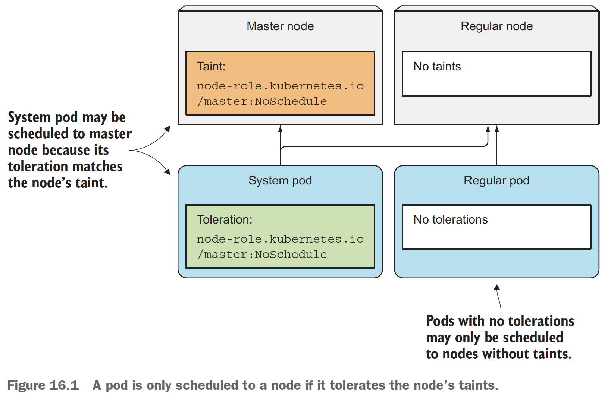
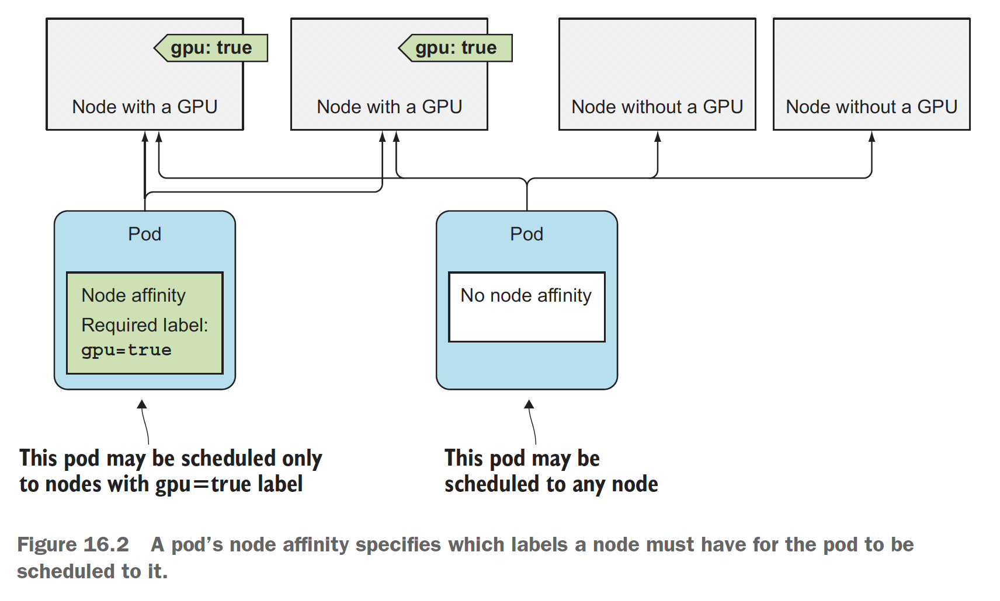
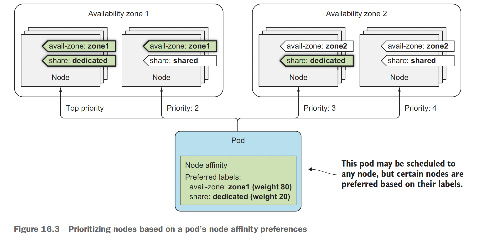
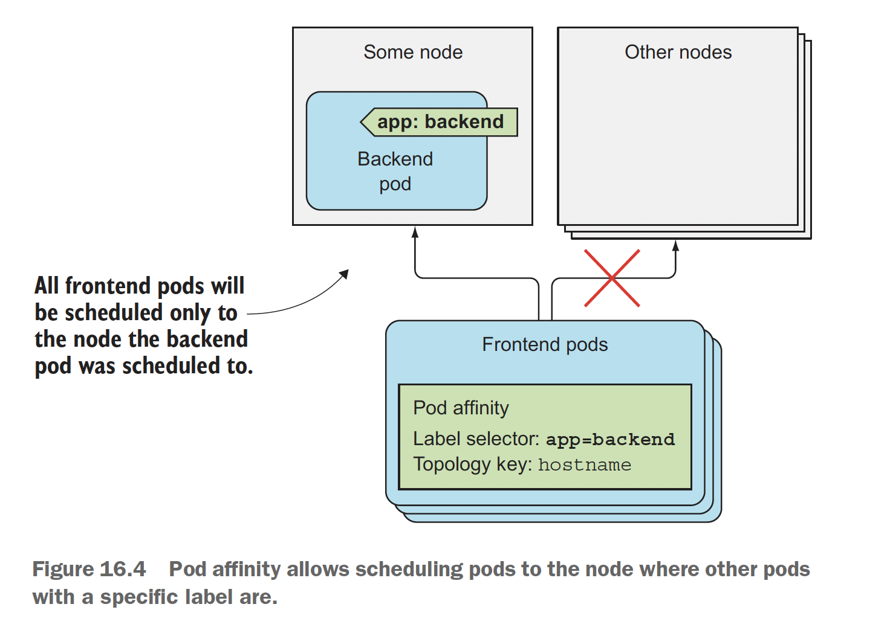
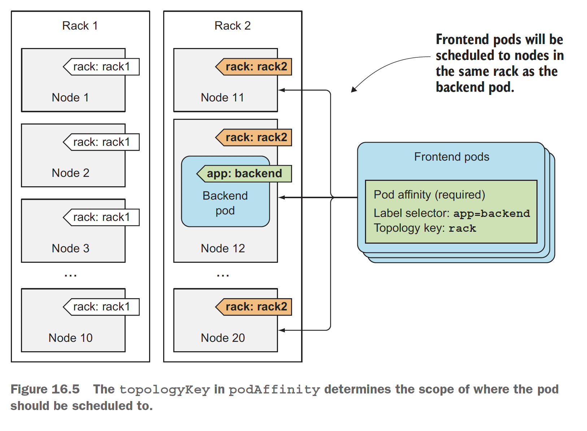

# 쿠버네티스 인 액션 16장 고급 스케줄링
> 
| 구분 | 설명 | 예제 | 특징 |
| - | - | - | - |
| Taints & Tolerations | 특정 Node 에만 배포해야 하거나, 배포하지 말아야 하는 규칙을 Node 에 Taints 로 남기고, Pod 에 Tolerations 를 부여하여 만족하는 경우에만 Scheduling 하는 기능이며, Taints 라는 별도의 속성을 가집니다 | NotReady, Unreachable 노드에 배포하지 않거나, Production 노드에 Dev 용 파드를 배포하지 않는 경우 | 한 번 결정나면 자주 변경되지 않는 다소 노드에 의존성을 두는 시스템 적인 제약으로 잘못 배포된 파드를 제거할 수도 있습니다 |
| Node Affinity | 특정 Node 에 배포 및 제약하는 점은 Taints 방식과 유사하지만, 어플리케이션 혹은 서비스 존 혹은 지역의 선호도 혹은 제약을 두고 싶은 경우, Labels 속성을 이용합니다 | Zone, Region, Hostname 같은 기본 속성 외에도 커스텀 라벨(gpu, ssd 등)을 이용할 수 있습니다 | 기 생성되어 있는 Labels 를 이용하거나, 별도로 추가한 Labels 값을 이용하여 비교적 변경 가능성이 높은 경우 사용하며, 현재 수행되고 있는 파드에 영향을 미치지는 못합니다 |
| Pod Affinity & Anti-affinity | 파드 간에 서로 가까이 배포하거나 혹은 해당 조건을 회피하도록 배포하는 경우를 말합니다 | frontend 와 backend 파드를 같이 혹은 다른 노드에 배포하고자 할 때 | - |


- 목차
  * [1. 테인트와 톨러레이션을 사용한 특정 노드에서 파드 실행 제한](#1-테인트와-톨러레이션을-이용한-파드실행-제한)
  * [2. 노드 어피니티를 사용해 파드를 특정 노드로 유인하기](#2-노드-어피니티를-이용한-노드유인)
  * [3. 파드 어피니티와 안티 어피니티를 이용해 파드 함께 배치하기](#3-파드-어피니티와-안티어피티니를-이용한-파드배치)


## 1 테인트와 톨러레이션을 이용한 파드실행 제한
> 노드 테인트와 파드 톨러레이션을 통해 *어떤 파드가 특정 노드를 사용할 수 있는지를 제한*할 때에 사용합니다. 즉 **노드에 묻은 얼룩(Taints)를 견딜만(Tolerations) 한 파드만 스케줄링이 가능**합니다. 기존의 *노드 셀렉터나 노드 어피니티 규칙*의 경우 특정 정보를 파드에 추가해서 파드가 명시적으로 스케줄링 되는 노드를 구분하는 반면, 테인트는 기존 파드를 수정하지 않고도, 노드에 테인트를 추가함으로써 특정 파드가 특정 노드에 배포되지 않도록 하는 기법입니다.

### 16.1.1 테인트와 톨러레이션
> 노드에 얼룩(**Taints for Node,**)을 뭍히고, 파드에 인내심(**Toleration for Pod**)을 부여합니다


### 16.1.2 노드에 사용자 정의 테인트 추가하기
* 톨러레이션을 이용하지 않고 배포하기 위한 디플로이먼트 작성
```yaml
apiVersion: apps/v1
kind: Deployment
metadata:
  name: nginx-deployment
  labels:
    app: nginx
spec:
  replicas: 3
  selector:
    matchLabels:
      app: nginx
  template:
    metadata:
      labels:
        app: nginx
    spec:
      containers:
      - name: nginx
        image: nginx:1.14.2
        ports:
        - containerPort: 80
```
* 톨러레이션 없이 배포 테스트
```bash
bash> kubectl get po -o wide
NAME                                        READY   STATUS    RESTARTS   AGE   IP          NODE                                   NOMINATED NODE   READINESS GATES
deployment-wo-toleration-574b87c764-d4rhz   1/1     Running   0          29s   10.84.1.6   gke-kubia-default-pool-13b40536-9q1p   <none>           <none>
deployment-wo-toleration-574b87c764-fr7kx   1/1     Running   0          29s   10.84.2.5   gke-kubia-default-pool-13b40536-kx7w   <none>           <none>
deployment-wo-toleration-574b87c764-zbhtg   1/1     Running   0          29s   10.84.0.5   gke-kubia-default-pool-13b40536-v6nf   <none>           <none>

bash> kubectl get nodes
NAME                                   STATUS   ROLES    AGE     VERSION
gke-kubia-default-pool-13b40536-9q1p   Ready    <none>   2m16s   v1.16.15-gke.4901
gke-kubia-default-pool-13b40536-kx7w   Ready    <none>   2m14s   v1.16.15-gke.4901
gke-kubia-default-pool-13b40536-v6nf   Ready    <none>   2m16s   v1.16.15-gke.4901

```

### 16.1.3 파드에 톨러레이션 추가
* 톨러레이션을 통한 테스트를 위한 디플로이먼트 작성
```yaml
apiVersion: apps/v1
kind: Deployment
metadata:
  name: busybox-w-toleration
  labels:
    app: prod
spec:
  replicas: 5
  selector:
    matchLabels:
      app: prod
  template:
    metadata:
      labels:
        app: prod
    spec:
      containers:
      - args:
        - sleep
        - "99999"
        image: busybox
        name: main
      tolerations:
      - key: node-type
        operator: Equal
        value: production
        effect: NoSchedule
```
* 톨러레이션을 테스트하기 위해 Taints 추가 및 파드 배포
```bash
bash> kubectl get nodes
NAME                                   STATUS   ROLES    AGE    VERSION
gke-kubia-default-pool-13b40536-9q1p   Ready    <none>   5m8s   v1.16.15-gke.4901
gke-kubia-default-pool-13b40536-kx7w   Ready    <none>   5m6s   v1.16.15-gke.4901
gke-kubia-default-pool-13b40536-v6nf   Ready    <none>   5m8s   v1.16.15-gke.4901

bash> kubectl taint node gke-kubia-default-pool-13b40536-9q1p node-type=production:NoSchedule
bash> kubectl taint node gke-kubia-default-pool-13b40536-9q1p node-type-
node/gke-kubia-default-pool-13b40536-9q1p untainted

bash> kubectl taint node gke-kubia-default-pool-13b40536-9q1p node-type=production:NoSchedule
bash> kubectl taint node gke-kubia-default-pool-13b40536-kx7w node-type=test:NoSchedule
bash> kubectl taint node gke-kubia-default-pool-13b40536-v6nf node-type=test:NoSchedule
bash> kubectl describe node | grep -i taints
Taints:             node-type=production:NoSchedule
Taints:             node-type=test:NoSchedule
Taints:             node-type=test:NoSchedule

bash> kubectl create -f deployment-w-toleration.yaml
bash> kubectl get pods -o wide # kx7w, v6nf 2개의 taints 가 허용된 노드에서만 배포되었습니다
NAME                                    READY   STATUS    RESTARTS   AGE   IP           NODE                                   NOMINATED NODE   READINESS GATES
busybox-w-toleration-6998475869-7gr8f   1/1     Running   0          30s   10.84.2.13   gke-kubia-default-pool-13b40536-kx7w   <none>           <none>
busybox-w-toleration-6998475869-7jpdz   1/1     Running   0          30s   10.84.2.12   gke-kubia-default-pool-13b40536-kx7w   <none>           <none>
busybox-w-toleration-6998475869-lb9cs   1/1     Running   0          30s   10.84.0.9    gke-kubia-default-pool-13b40536-v6nf   <none>           <none>
busybox-w-toleration-6998475869-r7ffz   1/1     Running   0          30s   10.84.2.11   gke-kubia-default-pool-13b40536-kx7w   <none>           <none>
busybox-w-toleration-6998475869-scvmc   1/1     Running   0          30s   10.84.0.8    gke-kubia-default-pool-13b40536-v6nf   <none>           <none>

bash> kubectl get nodes
NAME                                   STATUS   ROLES    AGE   VERSION
gke-kubia-default-pool-13b40536-9q1p   Ready    <none>   14m   v1.16.15-gke.4901
gke-kubia-default-pool-13b40536-kx7w   Ready    <none>   14m   v1.16.15-gke.4901
gke-kubia-default-pool-13b40536-v6nf   Ready    <none>   14m   v1.16.15-gke.4901
```

### 16.1.4 테이트와 톨러레이션의 활용 방안 이해
> 테인트는 키와 효과만 갖고 있어도 제약을 걸 수 있으므로, 값을 꼭 필요로 하지 않습니다.
반면 톨러레이션은 Equal 혹은 Exists 연산자를 이용하여 테인트 키에 여러 값을 허용할 수도 있습니다

* 테인트는 아래의 3가지 효과(Effect)를 활용합니다
  - 스케줄링을 방지 : NoSchedule
  - 선호하지 않는 노드를 정의하고 : PrefereNoSchedule
  - 노드에서 기존 파드를 제거한다 : NoExecute
* 노드 실패 후 파드를 재스케줄링하기 까지 시간
  - [Taint based Evictions](https://kubernetes.io/docs/concepts/scheduling-eviction/taint-and-toleration/#taint-based-evictions) 기준에 따르면 Kubernetes v1.18 부터는 **node controller 가 특정 상황(not-ready, unreachable 등)이 되는 경우 자동으로 taints** 하게 되어 아래의 경우에 eviction 될 수 있습니다
```yaml
...
  tolerations:
  - effect: NoSchedule
    key: node-type
    operator: Equal
    value: production
  - effect: NoExecute
    key: node.kubernetes.io/not-ready
    operator: Exists
    tolerationSeconds: 300
  - effect: NoExecute
    key: node.kubernetes.io/unreachable
    operator: Exists
    tolerationSeconds: 300
...
```

## 2 노드 어피니티를 이용한 노드유인
> 여태까지의 테인트는 파드를 특정 노드에서 떨어뜨려 놓는 데 사용되었습니다.
"노드 어피니티"라는 메커니즘은 **특정 노드 집합에만 파드를 스케줄링하도록 지시**할 수 있습니다.

* 노드 생성 시에 주요 레이블은 이미 생성되어 있습니다
  - 노드 어피니티는 노드 셀렉터와 같은 방식으로 레이블을 기반으로 노드를 선택합니다.
  - 노드의 라벨 가운데 중요한 레이블(region, zone, hostname 등)을 눈여겨 봅니다
```bash
bash> kubectl describe node <gke-node-name>
Name:               gke-kubia-default-pool-694e5d84-5h7t
Roles:              <none>
Labels:             beta.kubernetes.io/arch=amd64
                    beta.kubernetes.io/instance-type=g1-small
                    beta.kubernetes.io/os=linux
                    cloud.google.com/gke-nodepool=default-pool
                    cloud.google.com/gke-os-distribution=cos
                    failure-domain.beta.kubernetes.io/region=asia-northeast3
                    failure-domain.beta.kubernetes.io/zone=asia-northeast3-a
                    kubernetes.io/arch=amd64
                    kubernetes.io/hostname=gke-kubia-default-pool-694e5d84-5h7t
                    kubernetes.io/os=linux
```

### 16.2.1 하드 노드 어피니티 규칙 지정


* *노드 셀렉터*는 항상 해당 레이블이 정확하게 일치하는 경우만 매칭되므로, 라벨 관리가 번거로울 수 있습니다
  - 노드 셀렉터를 사용하는 파드
```yaml
apiVersion: v1
kind: Pod
metadata:
  name: kubia-gpu
spec:
  nodeSelector:
    gpu: "true"
  containers:
  - image: luksa/kubia
    name: kubia
```
* *노드 어피니티*는 보다 다양한 연산자를 통해 매칭이 가능합니다
  - 노드 어피티니 규칙을 사용하는 파드
```yaml
apiVersion: v1
kind: Pod
metadata:
  name: kubia-gpu
spec:
  affinity:
    nodeAffinity:
      # requiredDuringScheduling ... : 파드가 노드로 스케줄링 시에 필요한 레이블
      # ... IgnoredDuringExecution   : 이미 실행 중인 파드는 영향을 주지 않음
      requiredDuringSchedulingIgnoredDuringExecution:
        # gpu=true 인 라벨이 붙은 노드에만 스케줄링 됩니다
        nodeSelectorTerms:
        - matchExpressions:
          - key: gpu
            operator: In
            values:
            - "true"
  containers:
  - image: luksa/kubia
    name: kubia
```


### 16.2.2 파드의 스케줄링 시점에 노드 우선순위 지정
> 여기까지는 기존의 노드 셀렉터와 큰 차이가 없으나, preferredDuringScheduling... 을 통해 파드의 스케줄링 시에 우선순위를 지정할 수 있는 기법을 학습합니다


* g1-small 노드가 메모리가 너무 작아, 시간이 지남에 따라 시스템 메모리가 50%이상을 먹어 Pending 되고 있어 e2-small 노드로 전격교체
```bash
bash> gcloud container clusters delete kubia
bash> gcloud container clusters create kubia --num-nodes 3 --machine-type e2-small
```

* 선호하는 zone 과 machine 을 지정하지만, 여유 노드가 있다면 스케줄링 되지만, 그렇지 않다고 하더라도 문제는 아닌 경우
  - zone-name 에 가중치 80, shre-type 에 가중치 20 으로 모두 노드1에 배포되기를 기대했으나, 4개는 1개의 노드에 나머지는 2번째 노드에 배포 되었습니다
  - 스케줄러가 노드의 위치를 지정할 때에 Selector-SpreadPriority 기능을 통해 특정 노드에만 배포되면 장애 시에 위험할 수 있으므로 여러 노드에 분산하는 우선순위가 적용되기 때문입니다
```bash
bash> kubectl label node gke-kubia-default-pool-694e5d84-5h7t zone-name=zone1
bash> kubectl label node gke-kubia-default-pool-694e5d84-5h7t zone-name-

kubectl label node gke-kubia-default-pool-d5bbe7a9-j2lc zone-name=zone1
kubectl label node gke-kubia-default-pool-d5bbe7a9-s8x9 zone-name=zone1
kubectl label node gke-kubia-default-pool-d5bbe7a9-tzfh zone-name=zone2
kubectl label node gke-kubia-default-pool-d5bbe7a9-j2lc share-type=dedicated
kubectl label node gke-kubia-default-pool-d5bbe7a9-s8x9 share-type=shared
kubectl label node gke-kubia-default-pool-d5bbe7a9-tzfh share-type=shared

bash> kubectl get nodes -L zone-name -L share-type
NAME                                   STATUS   ROLES    AGE   VERSION             ZONE-NAME   SHARE-TYPE
gke-kubia-default-pool-d5bbe7a9-j2lc   Ready    <none>   30m   v1.16.15-gke.4901   zone1       dedicated
gke-kubia-default-pool-d5bbe7a9-s8x9   Ready    <none>   30m   v1.16.15-gke.4901   zone1       shared
gke-kubia-default-pool-d5bbe7a9-tzfh   Ready    <none>   30m   v1.16.15-gke.4901   zone2       shared

bash> kubectl create -f preferred-deployment.yaml
bash> kubectl get po -o wide # 예상대로 dedicated 노드에 2개 배포, 나머지 노드에 1개 배포되었습니다 (가중치 100에 2대, 80에 1대)
NAME                                   READY   STATUS    RESTARTS   AGE   IP          NODE                                   NOMINATED NODE   READINESS GATES
preferred-deployment-c7c79857b-gdszr   1/1     Running   0          23s   10.84.0.6   gke-kubia-default-pool-d5bbe7a9-s8x9   <none>           <none>
preferred-deployment-c7c79857b-swd8f   1/1     Running   0          23s   10.84.2.6   gke-kubia-default-pool-d5bbe7a9-j2lc   <none>           <none>
preferred-deployment-c7c79857b-xcprc   1/1     Running   0          23s   10.84.2.5   gke-kubia-default-pool-d5bbe7a9-j2lc   <none>           <none>

bash> kubectl create -f preferred-deployment-v2.yaml
bash> kubectl get po -o wide # 예상대로 node2 에 몰렸으며, Selector-SpreadPriority 는 확인할 수 없었습니다
NAME                                       READY   STATUS    RESTARTS   AGE     IP          NODE                                   NOMINATED NODE   READINESS GATES
preferred-deployment-c7c79857b-gdszr       1/1     Running   0          3m13s   10.84.0.6   gke-kubia-default-pool-d5bbe7a9-s8x9   <none>           <none>
preferred-deployment-c7c79857b-swd8f       1/1     Running   0          3m13s   10.84.2.6   gke-kubia-default-pool-d5bbe7a9-j2lc   <none>           <none>
preferred-deployment-c7c79857b-xcprc       1/1     Running   0          3m13s   10.84.2.5   gke-kubia-default-pool-d5bbe7a9-j2lc   <none>           <none>
preferred-deployment-v2-865c494569-pjxbl   1/1     Running   0          7s      10.84.1.5   gke-kubia-default-pool-d5bbe7a9-tzfh   <none>           <none>
preferred-deployment-v2-865c494569-srffs   1/1     Running   0          7s      10.84.1.7   gke-kubia-default-pool-d5bbe7a9-tzfh   <none>           <none>
preferred-deployment-v2-865c494569-t7p5r   1/1     Running   0          7s      10.84.1.6   gke-kubia-default-pool-d5bbe7a9-tzfh   <none>           <none>
```

* 이번에는 우리의 가정이 적절한지 확인을 하기위해 10개의 레플리카로 변경합니다
  - 6개는 
```bash
bash> kubectl create -f preferred-deployment-v3.yaml

bash> kubectl get nodes -L zone-name -L share-type
NAME                                   STATUS   ROLES    AGE   VERSION             ZONE-NAME   SHARE-TYPE
gke-kubia-default-pool-d5bbe7a9-j2lc   Ready    <none>   44m   v1.16.15-gke.4901   zone1       dedicated
gke-kubia-default-pool-d5bbe7a9-s8x9   Ready    <none>   44m   v1.16.15-gke.4901   zone1       shared
gke-kubia-default-pool-d5bbe7a9-tzfh   Ready    <none>   44m   v1.16.15-gke.4901   zone2       shared

bash> kubectl get pods -o wide  # 예상대로라면 zone2 가 80%, zone1 shared 가 20% 이어야 하지만
NAME                                       READY   STATUS    RESTARTS   AGE   IP           NODE                                   NOMINATED NODE   READINESS GATES
preferred-deployment-v2-865c494569-4pxbr   1/1     Running   0          14s   10.84.0.11   gke-kubia-default-pool-d5bbe7a9-s8x9   <none>           <none>
preferred-deployment-v2-865c494569-6l796   1/1     Running   0          14s   10.84.0.12   gke-kubia-default-pool-d5bbe7a9-s8x9   <none>           <none>
preferred-deployment-v2-865c494569-8kfjf   1/1     Running   0          14s   10.84.1.9    gke-kubia-default-pool-d5bbe7a9-tzfh   <none>           <none>
preferred-deployment-v2-865c494569-h5h92   1/1     Running   0          14s   10.84.0.10   gke-kubia-default-pool-d5bbe7a9-s8x9   <none>           <none>
preferred-deployment-v2-865c494569-nm7c5   1/1     Running   0          14s   10.84.0.9    gke-kubia-default-pool-d5bbe7a9-s8x9   <none>           <none>
preferred-deployment-v2-865c494569-p87cv   1/1     Running   0          14s   10.84.0.8    gke-kubia-default-pool-d5bbe7a9-s8x9   <none>           <none>
preferred-deployment-v2-865c494569-pv4tx   1/1     Running   0          14s   10.84.1.8    gke-kubia-default-pool-d5bbe7a9-tzfh   <none>           <none>
preferred-deployment-v2-865c494569-rxkt2   1/1     Running   0          14s   10.84.1.11   gke-kubia-default-pool-d5bbe7a9-tzfh   <none>           <none>
preferred-deployment-v2-865c494569-t2p6t   1/1     Running   0          14s   10.84.0.7    gke-kubia-default-pool-d5bbe7a9-s8x9   <none>           <none>
preferred-deployment-v2-865c494569-vczmc   1/1     Running   0          14s   10.84.1.10   gke-kubia-default-pool-d5bbe7a9-tzfh   <none>           <none>

bash> kubectl get pods -o wide | awk '{ print $7 }' | sort | uniq -c  # zone1, shared 가 6개, zone2, shared 는 4개가 배포되었음
   1 NODE
   6 gke-kubia-default-pool-d5bbe7a9-s8x9
   4 gke-kubia-default-pool-d5bbe7a9-tzfh

bash> kubectl get pods -o wide | awk '{ print $7 }' | sort | uniq -c  # 그래서 zone2 에서 4개의 파드를 임의로 종료했더니 !!
   1 NODE
   2 gke-kubia-default-pool-d5bbe7a9-j2lc
   4 gke-kubia-default-pool-d5bbe7a9-s8x9
   4 gke-kubia-default-pool-d5bbe7a9-tzfh
```
> 여기서 내린 결론은 리소스가 충분하지 않은 클러스터에서는 Preferred 옵션은 의도한대로 동작하지 않는다. 
또한 Preferred 옵션이 말그대로 선호도 이므로, 반드시 잘동작한다고 보기 어려우므로 중요한 경우에는 Required 를 쓰자

* 이번에는 Required 설정으로 테스트를 위해 디플로이먼트 생성
```yaml
apiVersion: apps/v1
kind: Deployment
metadata:
  name: required-deployment
spec:
  replicas: 5
  selector:
    matchLabels:
      app: required
  template:
    metadata:
      labels:
        app: required
    spec:
      affinity:
        nodeAffinity:
          requiredDuringSchedulingIgnoredDuringExecution:
            nodeSelectorTerms:
              - matchExpressions:
                - key: zone-name
                  operator: In
                  values: 
                  - zone1
      containers:
      - args:
        - sleep
        - "99999"
        image: busybox
        name: main
```
* Requred 디플로이먼트 테스트
```bash
bash> kubectl delete deployment --all
bash> kubectl create -f required-deployment.yaml
bash> kubectl get pods -o wide  # 의도한 대로 zone2, shared 에만 4개 배포되고 나머지는 Pending 되었습니다
NAME                                  READY   STATUS    RESTARTS   AGE   IP           NODE                                   NOMINATED NODE   READINESS GATES
required-deployment-98fd64f97-4wk5s   1/1     Running   0          18s   10.84.1.12   gke-kubia-default-pool-d5bbe7a9-tzfh   <none>           <none>
required-deployment-98fd64f97-6mb5s   0/1     Pending   0          18s   <none>       <none>                                 <none>           <none>
required-deployment-98fd64f97-8998k   0/1     Pending   0          18s   <none>       <none>                                 <none>           <none>
required-deployment-98fd64f97-dk6z9   1/1     Running   0          18s   10.84.1.14   gke-kubia-default-pool-d5bbe7a9-tzfh   <none>           <none>
required-deployment-98fd64f97-ghcbb   0/1     Pending   0          18s   <none>       <none>                                 <none>           <none>
required-deployment-98fd64f97-lgpc4   0/1     Pending   0          18s   <none>       <none>                                 <none>           <none>
required-deployment-98fd64f97-lkl5j   1/1     Running   0          18s   10.84.1.15   gke-kubia-default-pool-d5bbe7a9-tzfh   <none>           <none>
required-deployment-98fd64f97-qvplq   0/1     Pending   0          18s   <none>       <none>                                 <none>           <none>
required-deployment-98fd64f97-shx7h   0/1     Pending   0          18s   <none>       <none>                                 <none>           <none>
required-deployment-98fd64f97-x8vd2   1/1     Running   0          18s   10.84.1.13   gke-kubia-default-pool-d5bbe7a9-tzfh   <none>           <none>

bash> kubectl get nodes -L zone-name -L share-type
NAME                                   STATUS   ROLES    AGE   VERSION             ZONE-NAME   SHARE-TYPE
gke-kubia-default-pool-d5bbe7a9-j2lc   Ready    <none>   54m   v1.16.15-gke.4901   zone1       dedicated
gke-kubia-default-pool-d5bbe7a9-s8x9   Ready    <none>   54m   v1.16.15-gke.4901   zone1       shared
gke-kubia-default-pool-d5bbe7a9-tzfh   Ready    <none>   54m   v1.16.15-gke.4901   zone2       shared
```


## 3 파드 어피니티와 안티어피티니를 이용한 파드배치
> 파드와 노드간의 어피니티외에도 파드간의 어피니티를 지정할 필요가 있는데, 랙을 지정하거나 백엔드 파드와 프론트엔드 파드를 가깝게 혹은 멀리 배포할 수 있습니다
예제는 디플로이먼트에서 **app=backend 레이블이 있는 파드와 동일한 노드(topologyKey: kubernetes.io/hostname)에 배포되도록 설정**합니다


### 16.3.1 파드 간 어피니티를 이용해 같은 노드에 파드 배포하기
* 백엔드 노드를 생성하기 위한 디플로이먼트 생성
```yaml
apiVersion: apps/v1
kind: Deployment
metadata:
  name: backend
spec:
  replicas: 2
  selector:
    matchLabels:
      app: backend
  template:
    metadata:
      labels:
        app: backend
    spec:
      affinity:
        nodeAffinity:
          requiredDuringSchedulingIgnoredDuringExecution:
            nodeSelectorTerms:
              - matchExpressions:
                - key: zone-name
                  operator: In
                  values: 
                  - zone2
      containers:
      - args:
        - sleep
        - "99999"
        image: busybox
        name: main
```
* 프론트엔드 파드 어피니티 디플로이먼트
```yaml
apiVersion: apps/v1
kind: Deployment
metadata:
  name: frontend
spec:
  replicas: 2
  selector:
    matchLabels:
      app: frontend
  template:
    metadata:
      labels:
        app: frontend
    spec:
      affinity:
        nodeAffinity:
          requiredDuringSchedulingIgnoredDuringExecution:
            nodeSelectorTerms:
              - matchExpressions:
                - key: zone-name
                  operator: In
                  values: 
                  - zone2
        podAffinity:
          requiredDuringSchedulingIgnoredDuringExecution:
          - topologyKey: kubernetes.io/hostname
            labelSelector:
              matchLabels:
                app: backend
      containers:
      - name: main
        image: busybox
        args:
        - sleep
        - "99999"
```
* 같은 노드에 배포되는지 확인합니다
  - 이번에는 기존 라벨 제약을 없애고, 어피니티 테스트를 위해 기존 node-name 을 node2 로변경합니다
```bash
bash> 
kubectl label node gke-kubia-default-pool-d5bbe7a9-j2lc zone-name-
kubectl label node gke-kubia-default-pool-d5bbe7a9-j2lc zone-name=zone2
kubectl label node gke-kubia-default-pool-d5bbe7a9-s8x9 zone-name-
kubectl label node gke-kubia-default-pool-d5bbe7a9-s8x9 zone-name=zone2

bash> kubectl create -f frontend-podaffinity-host.yaml  # 백엔드 파드가 없는 경우는 Pending 상태가 됩니다
deployment.apps/frontend created

bash> kubectl get pods -o wide
NAME                        READY   STATUS    RESTARTS   AGE   IP       NODE     NOMINATED NODE   READINESS GATES
frontend-7457694d79-cctbn   0/1     Pending   0          9s    <none>   <none>   <none>           <none>
frontend-7457694d79-gtphr   0/1     Pending   0          9s    <none>   <none>   <none>           <none>
frontend-7457694d79-jhktz   0/1     Pending   0          9s    <none>   <none>   <none>           <none>
frontend-7457694d79-xvst7   0/1     Pending   0          9s    <none>   <none>   <none>           <none>
frontend-7457694d79-zv8nk   0/1     Pending   0          9s    <none>   <none>   <none>           <none>

bash> kubectl create -f backend-busybox.yaml
deployment.apps/backend created

bash> kubectl get pods -o wide  # 각각 5개의 백엔드와 프론트엔드를 배포하였을 때에 특정 노드에는 백엔드만 배포되는 기이한 현상이 발생합니다 !!!
NAME                        READY   STATUS              RESTARTS   AGE   IP          NODE                                   NOMINATED NODE   READINESS GATES
backend-bb6d5b5d8-bx5sq     0/1     ContainerCreating   0          3s    <none>      gke-kubia-default-pool-d5bbe7a9-tzfh   <none>           <none>
backend-bb6d5b5d8-kpjss     0/1     ContainerCreating   0          3s    <none>      gke-kubia-default-pool-d5bbe7a9-j2lc   <none>           <none>
backend-bb6d5b5d8-p72n7     0/1     ContainerCreating   0          3s    <none>      gke-kubia-default-pool-d5bbe7a9-s8x9   <none>           <none>
backend-bb6d5b5d8-wb28p     1/1     Running             0          3s    10.84.2.9   gke-kubia-default-pool-d5bbe7a9-j2lc   <none>           <none>
backend-bb6d5b5d8-xgr6k     0/1     ContainerCreating   0          3s    <none>      gke-kubia-default-pool-d5bbe7a9-s8x9   <none>           <none>
frontend-7457694d79-cctbn   0/1     ContainerCreating   0          19s   <none>      gke-kubia-default-pool-d5bbe7a9-s8x9   <none>           <none>
frontend-7457694d79-gtphr   0/1     ContainerCreating   0          19s   <none>      gke-kubia-default-pool-d5bbe7a9-s8x9   <none>           <none>
frontend-7457694d79-jhktz   0/1     ContainerCreating   0          19s   <none>      gke-kubia-default-pool-d5bbe7a9-s8x9   <none>           <none>
frontend-7457694d79-xvst7   0/1     ContainerCreating   0          19s   <none>      gke-kubia-default-pool-d5bbe7a9-s8x9   <none>           <none>
frontend-7457694d79-zv8nk   0/1     ContainerCreating   0          19s   <none>      gke-kubia-default-pool-d5bbe7a9-s8x9   <none>           <none>
```
> 나중에 알게 되었지만, **백엔드를 먼저 배포하고 프론트엔드를 배포해야 정상적인 어피니티를 기대할 수 있습**니다

* 이번에는 정확하게 3개의 레플리카로 구성하여 배포합니다
  - 
```bash
bash> 
kubectl create -f backend-busybox-v2.yaml
kubectl create -f frontend-podaffinity-host-v2.yaml

bash> 
kubectl get pods -o wide
NAME                        READY   STATUS    RESTARTS   AGE   IP           NODE                                   NOMINATED NODE   READINESS GATES
backend-bb6d5b5d8-8nwv9     1/1     Running   0          20s   10.84.0.25   gke-kubia-default-pool-d5bbe7a9-s8x9   <none>           <none>
backend-bb6d5b5d8-gjw7w     1/1     Running   0          20s   10.84.2.14   gke-kubia-default-pool-d5bbe7a9-j2lc   <none>           <none>
backend-bb6d5b5d8-p8zpx     1/1     Running   0          20s   10.84.1.24   gke-kubia-default-pool-d5bbe7a9-tzfh   <none>           <none>
frontend-7457694d79-krvzg   1/1     Running   0          5s    10.84.0.26   gke-kubia-default-pool-d5bbe7a9-s8x9   <none>           <none>
frontend-7457694d79-pzb8h   1/1     Running   0          5s    10.84.1.25   gke-kubia-default-pool-d5bbe7a9-tzfh   <none>           <none>
frontend-7457694d79-qjgmd   1/1     Running   0          5s    10.84.2.15   gke-kubia-default-pool-d5bbe7a9-j2lc   <none>           <none>
```

### 16.3.2 동일한 랙, 가용 영역 또는 리전에 파드 배포
> 노드 생성시에 결정되는 "가용 영역(zone)" 및 "리전(region)" 정보를 이용해서 배포할 수 있는데 이때에 사용되는 것이 **topologyKey** 속성이며 각각 아래와 같습니다

* 각 노드가 서로 다른 가용 영역에 있는 경우, 동일한 가용 영역에 파드 함께 배포하려면
  - topologyKey: failure-domain.beta.kubernetes.io/zone
* 같은 리전에 파드를 함께 배포하려면 
  - topologyKey: failure-domain.beta.kubernetes.io/region
* 같은 랙에 파드를 함께 배포하기
  - 여기서는 호스트 대신, "TopologyKey: rack"으로 지정했기 때문에, 프론트엔드 배포 시에 "app:backend" AND "rack: rack2" 조건에 매칭되는 노드가 후보입니다


* 토폴로지 랙 설정을 통한 파드 어피니티의 예제
  - 아래와 같이 topologyKey 에 설정한 rack 을 넣습니다
```yaml
...
podAffinity:
  requiredDuringSchedulingIgnoredDuringExecution:
  - topologyKey: rack
    labelSelector:
      matchLabels:
        app: backend
...
```
* 토폴로지 호스트 이름 설정을 통한 파드 어피니티의 예제
  - podAffinity : required 
```yaml
...
podAffinity:
  requiredDuringSchedulingIgnoredDuringExecution:
  - topologyKey: kubernetes.io/hostname
    labelSelector:
      matchLabels:
        app: backend
...
```
  - podAffinity : required : topologyKey
```yaml
...
podAffinity:
  requiredDuringSchedulingIgnoredDuringExecution:
  - topologyKey: kubernetes.io/hostname
    labelSelector:
      matchLabels:
        app: backend
...
```

### 16.3.3 필수 요구 사항 대신 파드 어피니티 선호도 표현하기
> 프론트엔드와 백엔드를 같이 배치하고 싶지만, 반드시 그렇지 않아도 되는 경우입니다


* 토폴로지 호스트 이름 설정을 통한 파드 어피니티의 예제
  - podAffinity : preferred
```yaml
...
podAffinity:
  preferredDuringSchedulingIgnoredDuringExecution:
  - weight: 80
    podAffinityTerm:
      topologyKey: kubernetes.io/hostname
      labelSelector:
        matchLabels:
          app: backend
...
```

### 16.3.4 파드 안티-어피니티를 사용하여 파드들이 서로 떨어지게 스케줄링하기
> 두 파드가 동일한 노드에 실행되는 경우 서로 성능에 영향을 주는 경우 (IO를 많이 사용하는 파드와 CPU 사용많은 파드를 섞는게 좋다. 그 반대의 경우는 Anti-Pattern)에 사용합니다

* 안티-어피니티를 이용하여 프론트엔드와 떨어진 노드에 배포하기, 펜딩은 되어도 같이는 못 살겠다 !!
```bash
bash> k create -f frontend-podantiaffinity-host.yaml
bash> k get po -o wide
NAME                             READY   STATUS    RESTARTS   AGE   IP           NODE                                   NOMINATED NODE   READINESS GATES
frontend-6b7cf99bb5-4sk25        1/1     Running   0          35m   10.84.2.11   gke-kubia-default-pool-001c8246-6hjr   <none>           <none>
frontend-6b7cf99bb5-h7fpd        1/1     Running   0          35m   10.84.0.15   gke-kubia-default-pool-001c8246-zljb   <none>           <none>
frontend-anti-79f9d8d6f5-66qqz   1/1     Running   0          27s   10.84.1.17   gke-kubia-default-pool-001c8246-3jw4   <none>           <none>
frontend-anti-79f9d8d6f5-6lbfn   0/1     Pending   0          27s   <none>       <none>                                 <none>           <none>
frontend-anti-79f9d8d6f5-762s4   1/1     Running   0          27s   10.84.1.18   gke-kubia-default-pool-001c8246-3jw4   <none>           <none>
frontend-anti-79f9d8d6f5-n82n2   1/1     Running   0          27s   10.84.1.16   gke-kubia-default-pool-001c8246-3jw4   <none>           <none>
frontend-anti-79f9d8d6f5-vsvhq   1/1     Running   0          27s   10.84.1.19   gke-kubia-default-pool-001c8246-3jw4   <none>           <none>
```


## 4. 실습해보고 싶은 내용
* 노드 3개에 골고루 busybox 를 배포하고, 특정 노드에만 NoExecute Taint 를 추가하면 어떻게 되는가?
* 추가된 Taints 및 Label 삭제는 어떻게 하는가?
* 같은 zone, region, hostname 에 배포하기 위해서는 어떻게 설정할 수 있는가?


## 5. 요약
* Taint & Tolerance 의 경우 특정 Node 에 Pod 를 배포되어야 하거나, 되지 말아야 하는 경우
  - Taint 는 Label 이 아니라 Key, Value, Effect 로 구분된 별도의 메타정보입니다
  - 아직 준비되지 않은 노드 혹은 응답이 없는 노드에 배포하지 말아야 하는 경우
  - 프로덕션 노드에 개발 파드가 배포되지 않도록, LIVE, RC, DEV 등을 구분해야 하는 경우
* Node Affinity 통한 
  - Node Affinity 는 Label 에 지정된 값을 통해 특정 노드로 파드를 유인합니다
  - Region, Zone, Hostname 등의 사전에 정의된 라벨을 통하여 노드를 선택할 수 있습니다
  - preferredDuringScheduling 과 같이 강제하지 않을 수도 있고, requiredDuringScheduling 과 같이 강제할 수도 있습니다
* Pod Affinity 와 Anti Affinity 는 파드 간의 같이 혹은 떨어진 상태로 배포를 합니다
  - Pod 간에 서로 같이 배포 혹은 떨어뜨려서 배포해야 하는 경우 사용 (어플리케이션의 성능, 튜닝에 가까운 설정)
  - Topology Key 를 활용하여 Rack 수준에서의 배포도 가능합니다 (이 또한 어플리케이션의 네트워크 성능을 올리는 것이므로, 튜닝에 가까운 설정)
  - Taint 와 Toleration 은 시스템 관리자가 설정해 두는 영역이고, Affinity 와 Anti-affinity 는 개발자가 설정하는 영역으로 보인다


